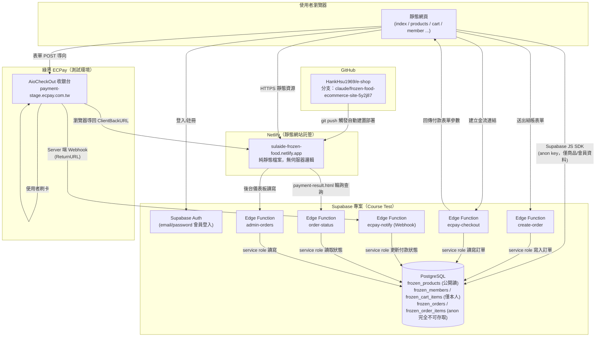
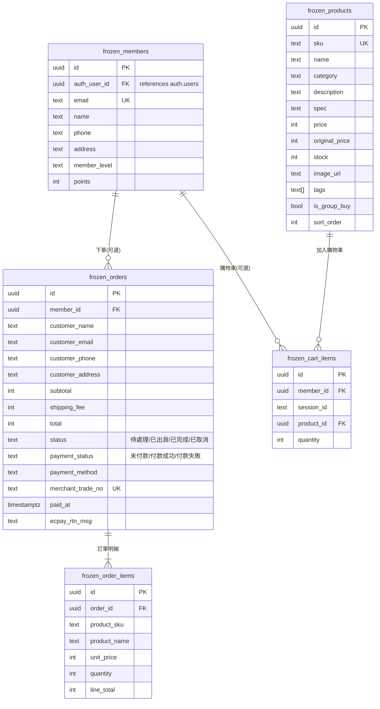
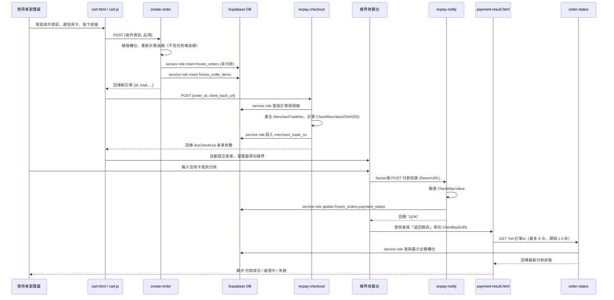

# 速來得網購團購網 — 系統架構規格書

版本：v1.0　最後更新：2026-07-02

## 1. 系統概述

「速來得網購團購網」是一個冷凍調理食品的網購／團購網站，採用**純前端靜態網站 + BaaS（Backend as a Service）+ 第三方金流**的輕量架構，沒有自建的應用伺服器。

| 角色 | 使用服務 | 說明 |
|---|---|---|
| 前端網站 | 靜態 HTML/CSS/JS，託管於 **Netlify** | 5 個主要頁面 + 2 個輔助頁面，無框架、無建置流程 |
| 資料庫 / 會員系統 / 無伺服器函式 | **Supabase**（專案：Course Test） | PostgreSQL 資料庫、Auth 會員系統、Edge Functions |
| 金流 | **綠界科技 ECPay**（目前為測試環境） | 信用卡收單，透過 Supabase Edge Functions 中介 |
| 版本控制 / CI 觸發 | **GitHub**（HankHsu1969/e-shop） | Netlify 監聽此 repo 的分支自動部署 |

---

## 2. 系統架構圖

---

## 3. 前端頁面清單

所有頁面共用固定導覽列（`.site-header` / `.main-nav`）與品牌色系（見 `css/style.css` 的 CSS 變數 `--color-primary` 等），彼此為獨立 HTML 檔案，非 SPA。

| 檔案 | 對應功能 | 主要相依 JS |
|---|---|---|
| `index.html` | 主畫面（Hero、精選商品、品牌介紹） | `products.js`、`products-data.js` |
| `brand-story.html` | 品牌故事 | 無資料庫存取 |
| `products.html` | 商品列表、搜尋、分類篩選 | `products.js` |
| `cart.html` | 購物車、結帳、付款方式選擇（信用卡／貨到付款） | `cart.js` |
| `member.html` | 會員註冊／登入／資料編輯 | `member.js` |
| `payment-result.html` | 綠界付款導回頁，輪詢訂單付款狀態 | `payment-result.js` |
| `dashboard.html` | **內部**訂單後台儀表板（footer 連結進入，不在主導覽列） | `dashboard.js` |

共用模組：

- `js/supabase-client.js`：建立全域 `supabaseClient`（Supabase URL + anon/publishable key）
- `js/main.js`：購物車 localStorage 存取、Toast 提示、導覽列手機版選單
- `js/products-data.js`：10 筆商品的**離線備援資料**（Supabase 連不上時前端會 fallback 使用）

---

## 4. 資料庫結構（Supabase Postgres）

> 注意：Course Test 這個 Supabase 專案原本就有 `customers` / `categories` / `drinks` / `profiles` / `orders` / `order_items` 等舊表（來自其他練習專案），與本網站的 `frozen_*` 系列資料表**互不相關**，刻意用 `frozen_` 前綴區隔避免混用。

### RLS（Row Level Security）現況（2026-08 起已收緊）

所有 `frozen_*` 資料表皆已啟用 RLS，權限現況如下：

| 資料表 | anon key 直接存取 | 說明 |
|---|---|---|
| `frozen_products` | 可讀（SELECT） | 商品目錄本來就設計為公開瀏覽 |
| `frozen_members` | 僅本人（`auth.uid() = auth_user_id`） | 需登入 Supabase Auth，才能讀寫自己的會員資料 |
| `frozen_cart_items` | 僅本人（`member_id` 對應 `auth.uid()`） | 目前前端尚未串接使用，先收緊避免未來誤用時暴露 |
| `frozen_orders` / `frozen_order_items` | **完全不開放**（無任何 anon 政策） | 訂單建立、查詢、後台管理一律改走下方的 Edge Functions，不再讓前端 anon key 直接碰觸這兩張表 |

會這樣設計是因為本站保留「訪客免登入結帳」與「後台儀表板無真正帳號系統」這兩個功能，若只是單純用 `auth.uid()` 限制 SELECT/UPDATE，訪客下單後將無法查詢自己的付款結果、後台也讀不到任何訂單。因此改用**服務端（service role）Edge Functions 作為唯一存取入口**：前端 anon key 完全無法直接讀寫 `frozen_orders`／`frozen_order_items`，所有動作都必須通過下方對應的 Function 驗證與轉發。

- 後台 `dashboard.html` 仍用一組通行碼（`sulaide2026`）做門檻，但現在該通行碼會被 `admin-orders` Function 在伺服器端驗證後才放行資料，**不再只是前端 UI 遮擋**（之前就算通行碼答錯，直接用 anon key 打 API 一樣能讀到全部訂單；現在完全讀不到）。

---

## 5. Supabase Edge Functions

| Function | 觸發者 | JWT 驗證 | 用途 |
|---|---|---|---|
| `create-order` | 前端 `cart.js`（使用者送出結帳表單） | 否（`verify_jwt=false`，訪客免登入下單） | 驗證商品/數量格式、計算金額，寫入 `frozen_orders` + `frozen_order_items`，回傳新訂單 |
| `order-status` | 前端 `payment-result.js`（輪詢付款結果） | 否 | 依訂單 id 回傳最少必要欄位（付款狀態、金額、方式），不回傳個資 |
| `admin-orders` | 後台 `dashboard.js` | 否，改用 `x-admin-passcode` 標頭驗證通行碼 | 列出全部訂單（GET）／更新訂單出貨狀態（PATCH） |
| `ecpay-checkout` | 前端 `cart.js`（使用者按下「前往結帳」且選信用卡） | 否（`verify_jwt=false`，一般訪客結帳無登入） | 讀取訂單、組出綠界 `AioCheckOut` 表單參數並計算 `CheckMacValue`，回傳給前端自動送出表單 |
| `ecpay-notify` | 綠界伺服器（`ReturnURL` webhook，非使用者瀏覽器） | 否（改用 `CheckMacValue` 驗證來源合法性） | 驗證綠界回傳的 `CheckMacValue`，更新 `frozen_orders.payment_status` |

以上皆使用 `SUPABASE_SERVICE_ROLE_KEY`（Supabase 自動注入的環境變數）直接呼叫 PostgREST，繞過 RLS 限制。由於 `frozen_orders`／`frozen_order_items` 已不對 anon key 開放任何直接存取，這五支 Function 是唯二能讀寫這兩張表的路徑，而不是像過去那樣前端可以繞過 Function 直接呼叫 Supabase REST API。

### 金流串接關鍵參數

- 環境：綠界**測試環境**（`payment-stage.ecpay.com.tw`）
- MerchantID：`3002607`（測試帳號，僅供 sandbox 使用）
- 簽章演算法：**SHA256**（`EncryptType: 1`）— 此為 AioCheckOut 服務對應規則，注意綠界的物流測試帳號是另一組帳號、且用 MD5，兩者不可混用

---

## 6. 金流付款時序圖

> anon key 全程不曾直接接觸 `frozen_orders`／`frozen_order_items`：前端只知道 Edge Function 的網址，實際的資料表存取一律由 service role 在伺服器端完成。

---

## 7. 部署與環境資訊

| 項目 | 內容 |
|---|---|
| 原始碼倉庫 | GitHub `HankHsu1969/e-shop`，開發分支 `claude/frozen-food-ecommerce-site-5y2j87` |
| 前端託管 | Netlify 專案 `sulaide-frozen-food`，已連接上述 GitHub 分支，push 後自動建置部署（無 build command，publish directory 為根目錄） |
| 資料庫 / Auth / Edge Functions | Supabase 專案 **Course Test**（project_id: `cbaapxvsgaqsogqijtzo`） |
| 金流 | 綠界 ECPay 測試環境（尚未申請正式特約商店） |
| 前端連線金鑰 | `js/supabase-client.js` 內硬編碼 Supabase URL + **publishable/anon key**（此為公開金鑰，設計上可曝露於前端，安全性依賴 RLS） |

---

## 8. 已知限制 / 上線前待辦

1. ~~RLS 政策過於寬鬆~~ **已修正（2026-08）**：`frozen_orders`／`frozen_order_items` 已完全收回 anon 直接存取權限，改由 `create-order`／`order-status`／`admin-orders` 三支 Edge Functions 代理；`frozen_members`／`frozen_cart_items` 已改為只能存取本人資料。
2. **後台儀表板仍非正式帳號權限系統**：`admin-orders` Function 雖然已把驗證邏輯搬到伺服器端，但仍是「單一組共用通行碼」（`sulaide2026`），並非個別帳號、也無法記錄是誰操作。正式上線前建議改用 Supabase Auth 角色 + RLS 搭配後台專屬登入。
3. **金流為測試環境**：需向綠界申請正式特約商店代號，並將 `ECPAY_MERCHANT_ID` / `ECPAY_HASH_KEY` / `ECPAY_HASH_IV` 換成正式環境金鑰（目前寫死在 Edge Function 原始碼中，正式金鑰應改存於 Supabase 的 Function 環境變數，不可提交進版本控制），同時將 `ECPAY_CHECKOUT_URL` 由 `payment-stage.ecpay.com.tw` 改為正式 `payment.ecpay.com.tw`。
4. **會員系統與購物車尚未完全綁定 Supabase**：目前購物車以 `localStorage` 為主，只有下單當下才會呼叫 `create-order` 寫入 Supabase；`frozen_cart_items` 表已建立且已加上 RLS，但前端尚未串接使用。
5. **Netlify 網域為預設子網域**：尚未綁定自訂網域（如 sulaide.com.tw）。
6. **與其他課程共用同一個 Supabase 專案**：本網站與其他練習共用同一個 project（Course Test），若要把本專案公開當教材，建議搬到獨立的 Supabase 專案，避免公開 `SUPABASE_URL`／anon key 時牽連到其他練習資料。
